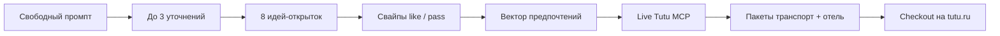
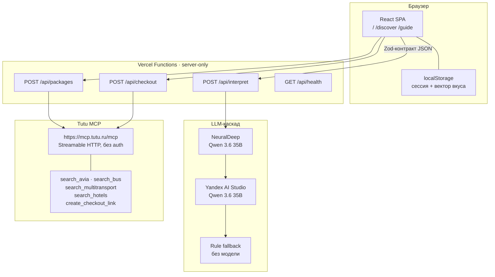

# 🎫 Туту Куда?

**Swipe-сервис подбора поездки:** свободный текст → карточки-идеи с обучением на лайках → живые пакеты Туту (транспорт + отель) → оформление на [tutu.ru](https://www.tutu.ru/).

Живые цены, расписания и checkout приходят из [Tutu MCP](https://mcp.tutu.ru/mcp). Приложение ничего не выдумывает про билеты и не принимает оплату.

[Live demo](https://tutu-mcp-ai-hackathon.vercel.app)
[Guide](https://tutu-mcp-ai-hackathon.vercel.app/guide)
[Discover](https://tutu-mcp-ai-hackathon.vercel.app/discover)
[Stack](#-технологический-стек)
[MCP](https://mcp.tutu.ru/mcp)


---


## ✨ О проекте

**Туту Куда?** — mobile-first веб-приложение для хакатона Tutu MCP. Человек описывает поездку своими словами («тихо к морю на несколько дней», «городской уикенд с едой»), свайпает восемь живых открыток-направлений, а сервис собирает реальные варианты Туту под выученный вкус.

Внутри хакатонного трека это **interface solution + agent experiments**: LLM понимает намерение, Tutu MCP остаётся единственным источником travel-фактов.


|                               |                                                               |
| ----------------------------- | ------------------------------------------------------------- |
| **Продуктовое имя**           | Туту Куда?                                                    |
| **Формат**                    | SPA + serverless API, один деплой на Vercel                   |
| **Главный сценарий**          | `/discover` — промпт → уточнения → свайпы → пакеты → checkout |
| **Документация для человека** | интерактивный гид `/guide`                                    |
| **Данные о поездке**          | live Tutu MCP, без моков в production-пути                    |
| **Оплата**                    | только на tutu.ru по проверенной HTTPS-ссылке                 |


---


## 🚀 Живое демо

Приложение уже в проде. Ссылки рабочие:

- **Онбординг:** [гид «Как это работает»](https://tutu-mcp-ai-hackathon.vercel.app/guide)
- **Интерактивный подбор:** [Discover](https://tutu-mcp-ai-hackathon.vercel.app/discover)
- **Лендинг:** [tutu-mcp-ai-hackathon.vercel.app](https://tutu-mcp-ai-hackathon.vercel.app)


---


## 🎯 Задача, которую закрываем

Сравнение поездки на Туту — это десятки вкладок: куда ехать, каким транспортом, где жить, влезает ли бюджет. Человек часто ещё **не знает направление**, только ощущение.

Туту Куда? разделяет два разных решения:

1. **Куда ехать** — LLM и свайпы по идеям, без выдуманных цен.
2. **Чем ехать и где жить** — только live Tutu MCP: самолёты, мультитранспорт / автобусы, отели, checkout.

Так Туту остаётся источником правды о рынке, а интерфейс снимает паралич выбора.

---


## 🧭 Как это работает




1. Пользователь пишет запрос на русском и при необходимости отвечает максимум на **три** коротких вопроса (город выезда, даты, состав группы, бюджет).
2. Сервер возвращает **ровно восемь** направлений. На карточках нет цен — их ещё нет, пока не спросили MCP.
3. Свайп вправо / кнопка «Хочу» усиливает теги вкуса; влево / «Не сейчас» ослабляет. Работают мышь, тач и клавиши `←` `→`.
4. После колоды сервис показывает, **чему научился**, и запрашивает пакеты максимум для нескольких лайкнутых идей.
5. Пакеты ранжируются: 85% релевантности к вкусу и цене, 15% ε-greedy исследования (детерминированно от session seed).
6. Checkout — непрозрачные `checkoutRef` с MCP превращаются в URL `tutu.ru`. Оплата только там.

Сессия живёт в `localStorage` (`tutu-kuda-session-v2`): reload не сбрасывает колоду. Сервер сессий не хранит.

---


## 🏗️ Архитектура

Один деплойный контур: Vite-SPA и Vercel Functions в `apps/app`. Браузер **никогда** не ходит в LLM и Tutu MCP напрямую.




### Граница доверия


| Слой             | Что знает                                                  | Чего не знает                                |
| ---------------- | ---------------------------------------------------------- | -------------------------------------------- |
| Браузер          | промпт, ответы, идеи, вектор вкуса, нормализованные пакеты | API-ключи, сырой MCP payload, PII на сервере |
| `/api/interpret` | текст и clarifications                                     | цены, рейсы, отели                           |
| `/api/packages`  | intent + идея + prefs                                      | ключи LLM                                    |
| `/api/checkout`  | opaque `checkoutRef`                                       | платёжные данные                             |
| Tutu MCP         | поиск и ссылка на корзину Туту                             | оплата внутри MCP                            |


Идентификаторы checkout — непрозрачные handles. Приложение не принимает платежи и не пишет пользовательские сессии в базу: её нет.

### Почему serverless, а не отдельный backend

Хакатонный продукт должен быть одним публичным URL. Vercel Functions дают тот же `Request` / `Response`, что и локальный Vite-плагин, поэтому обработчики в `apps/app/api/` запускаются и в проде, и на `npm run dev` без второго сервера. Секреты LLM остаются в env Functions и не попадают в бандл.

---


## 🧰 Технологический стек

Стек выбран под **один деплой, строгие контракты и устойчивый демо-путь**, а не под максимум библиотек.

### Фронтенд


| Технология                  | Роль                                | Почему именно это                                                                                                                                                                                           |
| --------------------------- | ----------------------------------- | ----------------------------------------------------------------------------------------------------------------------------------------------------------------------------------------------------------- |
| **Vite 8**                  | сборка SPA, HMR, preview            | Быстрый цикл на хакатоне, официальный React-плагин, Vercel `framework: vite`. Stable, без отдельного SSR.                                                                                                   |
| **React 19**                | UI                                  | TSX проверяется тем же TypeScript, что и API. Зрелая доступность, предсказуемая агентная генерация, Motion из коробки. Vue отвергли: лишний `vue-tsc` / SFC-контур при TypeScript 7 не давал выигрыша в UX. |
| **TypeScript 7 strict**     | общий язык клиента и сервера        | Одни типы на intent, ideas, packages, checkout. Native compiler ускоряет `typecheck` в CI.                                                                                                                  |
| **React Router 7**          | маршруты `/`, `/discover`, `/guide` | SPA с Vercel rewrites на `index.html`. Direct reload глубоких URL работает.                                                                                                                                 |
| **Motion**                  | физика свайпа                       | Drag, spring, `useReducedMotion`, паритет мыши и тача. Нить маршрута тянется за карточкой. Кнопки и клавиатура — полный fallback без drag.                                                                  |
| **CSS-токены + global CSS** | визуальная система Tutu Lab         | Бренд `#0D0B68` / `#7D71FF`, бумага открытки, штамп-логотип. Tailwind не использовали: utility-каша ломает «живую открытку» и усложняет ревью.                                                              |
| **Onest Variable**          | шрифт                               | Self-hosted `@fontsource-variable/onest`, без внешних фонтовых CDN в критическом пути.                                                                                                                      |
| **localStorage**            | сессия потока                       | Нет аккаунтов и БД. Zustand / TanStack Query не понадобились: четыре API-вызова и один session-объект.                                                                                                      |


### Бэкенд и интеграции


| Технология                                      | Роль                                 | Почему именно это                                                                                                                        |
| ----------------------------------------------- | ------------------------------------ | ---------------------------------------------------------------------------------------------------------------------------------------- |
| **Vercel Node Functions** (Web Handler `fetch`) | `/api/`*                             | Один git-root, те же хендлеры локально через Vite middleware. Стандартный Fetch API, без Express.                                        |
| **Zod**                                         | вход API, JSON LLM, нормализация MCP | Fail-closed на границе. Невалидный LLM-ответ = следующий провайдер или rule fallback, а не «почти JSON» в UI.                            |
| `@modelcontextprotocol/client`                  | Tutu MCP                             | Официальный `Client` + `StreamableHTTPClientTransport`. Новое соединение на запрос, `close()` в `finally`.                               |
| **NeuralDeep**                                  | основной LLM                         | OpenAI-compatible `/chat/completions`, JSON mode, модель `qwen3.6-35b-a3b-noreason`, таймаут 8 с.                                        |
| **Yandex AI Studio**                            | второй LLM                           | Другой поставщик и другой endpoint (`/v1/responses`). Та же семья Qwen, JSON object format. Если NeuralDeep недоступен — демо не падает. |
| **Детерминированный fallback**                  | третий контур                        | Без сети и ключей: парсинг города/дат/группы + 8 идей из каталога. Идеи могут быть, **факты Туту — нет**.                                |
| **Vitest 4**                                    | unit/integration                     | Тот же pipeline, что Vite. Контракты, prefs, MCP retry, interpret, packages.                                                             |
| **npm workspaces**                              | монорепо                             | Уже был `package-lock.json`; второй менеджер пакетов не заводили.                                                                        |


React Compiler, SSR, отдельный backend-фреймворк и Tailwind сознательно не входят в MVP: они не закрывают критерий жюри и расширяют поверхность отказа на демо.

---


## 🎨 Фронтенд: экраны и UX

Публичные маршруты:


| Маршрут     | Назначение                                  |
| ----------- | ------------------------------------------- |
| `/`         | Лендинг: ценность, CTA в Discover и гид     |
| `/discover` | Весь рабочий поток подбора                  |
| `/guide`    | Интерактивная пользовательская документация |
| `*`         | Русский 404 с возвратом на маршрут          |


### Discover

Фазы сессии: `intent` → `clarify` → `deck` → `reveal` → `loading` → `packages` (или `error`).

- Промпт + три быстрых примера («к морю», «городской уикенд», «перезагрузка на природе»).
- Уточнения — форма, не бесконечный чат: состав группы задаётся числами `adults` / `children`, не фразой.
- Колода — `SwipePostcard`: drag с порогом, spring-возврат, нить `RouteThread`, кнопки «Не сейчас» / «Хочу».
- После колоды — видимые сигналы вкуса (`topSignals`), затем живые пакеты.
- Состояния загрузки, ошибки с retry и предупреждения частичного MCP выводятся текстом, без молчаливого пустого экрана.

Визуальный язык: **Tutu Lab — живая открытка + маршрутная нить**. Токены в `apps/app/src/styles/tokens.css`.

---


## ⚙️ Бэкенд: API

Хендлеры: `apps/app/api/*.ts`. Тело запроса ограничено **16 KiB**. У каждого ответа есть `x-request-id`. Кэш: `no-store`.


| Метод                 | Назначение                              | Upstream                                      |
| --------------------- | --------------------------------------- | --------------------------------------------- |
| `POST /api/interpret` | Intent + 8 идей или ≤ 3 вопроса         | NeuralDeep → Yandex AI Studio → rule fallback |
| `POST /api/packages`  | Живые пакеты под идею                   | Tutu MCP                                      |
| `POST /api/checkout`  | Ссылка(и) оформления                    | `create_checkout_link`                        |
| `GET /api/health`     | Готовность без секретов и без live-проб | только конфиг                                 |


### `POST /api/interpret`

Вход: `{ prompt, answers?, locale: "ru-RU" }`.

Ответ — discriminated union:

- `needs_clarification` — вопросы и `draftIntent`;
- `ready` — полный `intent`, ровно 8 `ideas`, флаг `generation: "llm" | "rule_fallback"`.

LLM **запрещено** выдумывать цены и расписание. Если не хватает города, дат, состава или бюджета — статус clarification, без скрытых дефолтов вроде «Москва / ближайшие выходные».

### `POST /api/packages`

Оркестратор в `apps/app/server/packages/orchestrator.ts`. Независимые вызовы идут через `Promise.allSettled`.


| Состав   | Инструменты MCP                                                                                          |
| -------- | -------------------------------------------------------------------------------------------------------- |
| Взрослые | `search_avia` (round-trip) + `search_multitransport` × 2 + `search_hotels`                               |
| С детьми | `search_avia` + `search_bus` × 2 + `search_hotels` (`children_ages`); отдельный rail-поиск не вызывается |


Таймауты: **12 с** на вызов MCP, **20 с** на весь route. Повтор один раз только на сетевые 429/502/503/504; timeout внутри бюджета не ретраится.

Цены пакетов честно размечены:

- `exact_round_trip` — авиа round-trip + сумма проживания;
- `estimated_split_trip` — два отдельных плеча.

Сумма отеля — **за пребывание**, не «за ночь × ночи».

### `POST /api/checkout`

Принимает `{ checkoutRef }` или `{ refs }`. URL проходит allowlist: только `https:` и хост Туту. Ссылка не пересобирается руками — byte-for-byte от MCP.

### `GET /api/health`

Конфиг-only: `app` / `llm` / `mcp`, fingerprint инструментов, бюджеты таймаутов. Upstream не дергает, ключи не печатает. `llm: degraded`, если нет `NEURALDEEP_API_KEY` — interpret всё равно жив за счёт fallback.

---


## 🧠 LLM: несколько моделей и несколько поставщиков

Interpret — единственное место, где нужна языковая модель. Каскад задуман так, чтобы **демо не зависело от одного облака**.

```text
NeuralDeep (primary)  →  Yandex AI Studio (provider fallback)  →  rule fallback
     8 s JSON mode              8 s JSON object                      без сети
```


| Ступень | Поставщик                                                   | Модель по умолчанию              | Зачем                                                                                               |
| ------- | ----------------------------------------------------------- | -------------------------------- | --------------------------------------------------------------------------------------------------- |
| 1       | **NeuralDeep** (`https://api.neuraldeep.ru/v1`)             | `qwen3.6-35b-a3b-noreason`       | Быстрый JSON intent + 8 идей. OpenAI-compatible `chat/completions`.                                 |
| 2       | **Yandex AI Studio** (`https://ai.api.cloud.yandex.net/v1`) | `gpt://<folder>/qwen3.6-35b-a3b` | Другой юр. контур и API. Если NeuralDeep 5xx/timeout — берём ту же семью Qwen с другого провайдера. |
| 3       | **Rule fallback** в процессе Node                           | нет LLM                          | Регексп/словари: город, даты, party, бюджет; 8 идей из фиксированного пула направлений РФ.          |


Ключи только на сервере: `NEURALDEEP_API_KEY`, `YC_API_KEY` + `YC_FOLDER_ID` (алиасы `YANDEX_*` тоже принимаются). Ответ любой модели проходит `generatedOutputSchema` (Zod). Не JSON / не та схема → тихий переход на следующую ступень, без стектрейса в UI.

Почему две облачные модели, а не одна: отказ провайдера на питче не должен обнулять продукт. Почему ещё и rule fallback: ключ могут не проставить, квота кончиться, JSON mode сломаться — тогда человек всё равно получит колоду и дойдёт до live MCP.

---


## 🔌 Tutu MCP


|                |                                         |
| -------------- | --------------------------------------- |
| Endpoint       | `https://mcp.tutu.ru/mcp`               |
| Транспорт      | remote Streamable HTTP                  |
| Авторизация    | нет                                     |
| Версия справки | live API **v0.38.0** (снято 2026-08-19) |


Через MCP в продукте:

- самолёты — `search_avia`
- автобусы — `search_bus` (семейный сценарий)
- мультитранспорт — `search_multitransport` (в т.ч. железнодорожная альтернатива без отдельного `search_rail`)
- отели — `search_hotels`
- оформление — `create_checkout_link`

Клиент MCP создаётся **на каждый HTTP-запрос** и закрывается в `finally`. Это требование serverless: нельзя держать transport между инвокациями.

Каноническая справка: `[docs/tutu-mcp/tutu-mcp.md](docs/tutu-mcp/tutu-mcp.md)`. Playbooks и dump `tools/list` лежат рядом. Публичной внешней доки почти нет — спецификация внутри сервера MCP; репозиторий держит живой слепок, чтобы жюри и агенты видели тот же контракт, что код.

---


## 🎛️ Предпочтения и ранжирование

Обучение на свайпах **видимо**: теги карточки меняют вектор, UI показывает топ-сигналы.


| Правило              | Значение                                                                     |
| -------------------- | ---------------------------------------------------------------------------- |
| Лайк                 | `+1.0` к тегам                                                               |
| Пасс                 | `−0.35` к тегам                                                              |
| Клип                 | веса в `[-1, 1]`                                                             |
| Ранжирование пакетов | 85% score (роль optimal, совпадение mode, цена)                              |
| Exploration          | 15% ε-greedy: с вероятностью 0.15 (от session seed) меняются 1-е и 2-е места |


Один и тот же `sessionSeed` даёт один и тот же порядок — демо воспроизводимо, «рандом ради рандома» нет.

---


## 🛡️ Надёжность


| Механизм                                    | Где                                               |
| ------------------------------------------- | ------------------------------------------------- |
| Каскад LLM + Zod                            | `apps/app/server/llm/providers.ts`, `fallback.ts` |
| MCP retry (без retry на timeout)            | `apps/app/server/mcp/retry.ts`                    |
| `Promise.allSettled` + частичные `warnings` | orchestrator пакетов                              |
| Бюджеты 8 / 12 / 20 с                       | `apps/app/server/mcp/tools.ts`                    |
| `/api/health`                               | конфиг, без утечки секретов                       |
| Smoke live MCP                              | `npm run --prefix apps/app mcp-smoke`             |
| Smoke оркестрации пакетов                   | `npm run --prefix apps/app packages-smoke`        |
| CI                                          | typecheck, test, build, mcp-smoke на Node 22      |


Production-путь **не подменяет** MCP моками. Fallback есть только у интерпретации текста.

---


## 🔐 Безопасность и приватность

- Секреты только в `.env.local` / Vercel env. В репозитории — `.env.example`.
- Промпт ограничен, тело — 16 KiB.
- Checkout URL: HTTPS + allowlist хоста Туту.
- Сырые MCP payload не показываются пользователю и не логируются целиком.
- Город, состав семьи и полный промпт не пишутся в production-логи как PII.
- Оплата, карты, аккаунты Туту — вне приложения.

---


## 📁 Структура репозитория

```text
tutu-mcp-ai-hackathon/
├── README.md                 ← вы здесь
├── AGENTS.md                 ← вход для AI-агентов
├── apps/app/                 ← единственное приложение
│   ├── api/                  ← Vercel Functions
│   ├── server/               ← LLM, MCP, packages, checkout
│   ├── shared/               ← Zod-контракты, prefs, party
│   ├── src/                  ← React UI
│   ├── tests/                ← Vitest
│   ├── scripts/              ← mcp-smoke, packages-smoke
│   └── vercel.json
├── docs/tutu-mcp/            ← live-справка MCP
├── docs/agents/              ← архитектура, verification, judging
├── docs/plans/               ← продукт и execution-планы
└── .github/workflows/ci.yml
```

Именованные экспорты во всём TypeScript — правило репозитория.

---


## 💻 Локальный запуск


### Что нужно

- **Node.js 22+** (CI ставит 22; npm workspaces)
- npm 10+ (идёт с Node)
- Git
- Опционально: ключи NeuralDeep и/или Yandex AI Studio — без них идеи строит rule fallback, пакеты Туту всё равно живые

Tutu MCP **не требует ключа**.

### Установка

```bash
git clone https://github.com/ed-would/tutu-mcp-ai-hackathon.git
cd tutu-mcp-ai-hackathon
npm ci
```


### Переменные окружения

Скопируйте шаблон приложения (ключи не коммитить):

```bash
cp apps/app/.env.example apps/app/.env.local
```


| Переменная                          | Обязательна             | Назначение                                                           |
| ----------------------------------- | ----------------------- | -------------------------------------------------------------------- |
| `NEURALDEEP_API_KEY`                | нет                     | Первый LLM. Ключ: [hub.neuraldeep.ru](https://hub.neuraldeep.ru/app) |
| `NEURALDEEP_MODEL`                  | нет                     | По умолчанию `qwen3.6-35b-a3b-noreason`                              |
| `YC_API_KEY` / `YANDEX_API_KEY`     | нет                     | Второй LLM, Yandex AI Studio                                         |
| `YC_FOLDER_ID` / `YANDEX_FOLDER_ID` | вместе с ключом Яндекса | Folder облака                                                        |
| `YC_MODEL` / `YANDEX_MODEL`         | нет                     | По умолчанию `gpt://<folder>/qwen3.6-35b-a3b`                        |


Корневой `.env.example` относится к внутреннему DeepSeek-воркеру агентов, не к пользовательскому приложению.

### Dev-сервер

```bash
npm run --prefix apps/app dev
```

Откройте [http://127.0.0.1:5173](http://127.0.0.1:5173).

Vite-плагин поднимает **те же** хендлеры, что Vercel:

- `POST /api/interpret`
- `POST /api/packages`
- `POST /api/checkout`

`GET /api/health` в проде отдаёт Function `apps/app/api/health.ts`; для локальной готовности достаточно, что `/discover` ходит в interpret/packages.

### Сборка как в проде

```bash
npm run --prefix apps/app typecheck
npm run --prefix apps/app test
npm run --prefix apps/app build
```

Превью статики: после `build` можно `npx --prefix apps/app vite preview` (порт 4173). API Functions в чистом preview без Vercel CLI не монтируются — для полного потока используйте `npm run --prefix apps/app dev` или задеплоенный URL.

### Деплой

Vercel, root приложения `apps/app` (`vercel.json`: `framework: vite`, rewrites `/discover` и `/guide` → `index.html`). Env те же, что в таблице выше. После выкладки: открыть `/`, `/guide`, `/discover` и `GET /api/health`.

---


## ✅ Проверки качества

Из корня репозитория:

```bash
npm run --prefix apps/app typecheck
npm run --prefix apps/app test
npm run --prefix apps/app build
npm run --prefix apps/app mcp-smoke
npm run --prefix apps/app packages-smoke
```

Живой MCP без приложения:

```bash
curl -s https://mcp.tutu.ru/mcp \
  -H 'Content-Type: application/json' \
  -H 'Accept: application/json, text/event-stream' \
  -d '{"jsonrpc":"2.0","id":1,"method":"tools/list"}' | jq .
```

CI (`.github/workflows/ci.yml`): `npm ci` → typecheck → test → build → mcp-smoke.

Покрытые тестами контуры: interpret + fallback, packages/orchestrator, checkout allowlist, prefs/ε-greedy, MCP retry, party/clarify, swipe, health, guide session.

---


## 📚 Документация


| Документ                                                                                         | Для кого                                      |
| ------------------------------------------------------------------------------------------------ | --------------------------------------------- |
| Этот README                                                                                      | жюри, запуск, архитектура                     |
| [https://tutu-mcp-ai-hackathon.vercel.app/guide](https://tutu-mcp-ai-hackathon.vercel.app/guide) | конечный пользователь, интерактивный туториал |
| `[docs/tutu-mcp/tutu-mcp.md](docs/tutu-mcp/tutu-mcp.md)`                                         | live MCP: инструменты и playbooks             |
| `[docs/plans/product-travel-tinder.md](docs/plans/product-travel-tinder.md)`                     | продуктовый reference                         |
| `[docs/plans/travel-tinder-exec-roadmap.md](docs/plans/travel-tinder-exec-roadmap.md)`           | порядок сборки вертикального среза            |
| `[docs/agents/architecture.md](docs/agents/architecture.md)`                                     | карта репозитория                             |
| `[docs/agents/mcp-integration.md](docs/agents/mcp-integration.md)`                               | контракт MCP для кода                         |
| `[AGENTS.md](AGENTS.md)`                                                                         | команды и вход для агентов                    |


---


## 🔗 Tutu MCP в IDE и чатах

Endpoint тот же: **[https://mcp.tutu.ru/mcp](https://mcp.tutu.ru/mcp)** — remote Streamable HTTP, без авторизации.

**Cursor** — `.cursor/mcp.json` (проект) или `~/.cursor/mcp.json`:

```json
{
  "mcpServers": {
    "tutu": {
      "url": "https://mcp.tutu.ru/mcp"
    }
  }
}
```

Сохранить → перезагрузить окно → **Cursor Settings → Tools & Integrations → MCP**.

**ChatGPT** (Plus / Pro / Team / Enterprise, Developer Mode): Settings → Connectors → Advanced → Developer Mode → Create → имя `Tutu`, URL `https://mcp.tutu.ru/mcp`, auth `None`.

**Claude:** Settings → Connectors → Add custom connector → `https://mcp.tutu.ru/mcp`.

**Claude Code:**

```bash
claude mcp add --transport http tutu https://mcp.tutu.ru/mcp
```

**OpenCode:**

```json
{
  "$schema": "https://opencode.ai/config.json",
  "mcp": {
    "tutu": {
      "type": "remote",
      "url": "https://mcp.tutu.ru/mcp",
      "enabled": true
    }
  }
}
```

Инструкция площадки: [mcp.tutu.ru/mcp](https://mcp.tutu.ru/mcp).

---


## 📦 Границы MVP

Сделано в вертикальном срезе: промпт, уточнения, восемь идей, свайпы, видимое обучение, live пакеты, checkout на Туту, гид, health, smoke, CI.

Намеренно **не** входит: аккаунты, база, оплата внутри приложения, dark mode, нативный iOS, голос, seat map, автовыбор мест/номеров, география вне России и СНГ.

Если LLM недоступны, колода идей идёт из rule fallback; **цены и билеты по-прежнему только из Tutu MCP**.

---


## 🧑‍⚖️ Для жюри

Короткий технический конспект под критерии хакатона:


| Критерий          | Как закрыто в коде                                                                  |
| ----------------- | ----------------------------------------------------------------------------------- |
| Тема / travel fit | Промпт → идеи → пакеты → tutu.ru; MCP не заменён моками                             |
| Глубина           | Idea deck, preference vector, orchestrator avia/bus/multitransport/hotels, checkout |
| UX                | Mobile-first, бренд-токены, свайп + кнопки + клавиатура, RU copy, loading/error     |
| Документация      | Этот README, `/guide`, `docs/tutu-mcp/`, `docs/plans/`, `docs/agents/`              |
| Инновация         | Видимое like-learning, structured JSON от LLM, ε-greedy ранжирование                |
| Стабильность      | Два LLM-поставщика + rule fallback, таймауты, retry, health, CI smoke               |
| Архитектура       | Чёткий server/client split, serverless MCP/LLM, один Vercel-деплой                  |
| Качество кода     | Named exports, Zod, Vitest, секреты вне git                                         |


