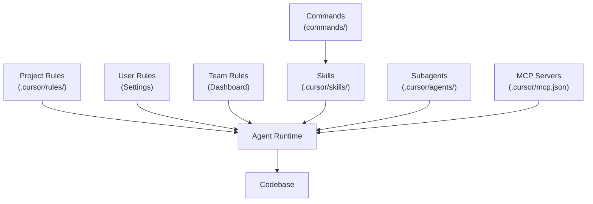

# 3. Cursor AI infrastructure map

**Purpose:** How Cursor loads rules, skills, commands, subagents, and MCP into the agent runtime.

**Non-goals:** Generic `src/` layering and `AGENTS.md` content → [standards/05-architecture-and-docs.md](../standards/05-architecture-and-docs.md).

---

## Diagram

**Key principle:** Rules tend to stay in active context; skills and subagents are invoked on demand; MCP extends tools.

---

## Sources

| Element                                        | Source                                                                                                                                                                                                                                                                 |
| ---------------------------------------------- | ---------------------------------------------------------------------------------------------------------------------------------------------------------------------------------------------------------------------------------------------------------------------- |
| Rules / skills / subagents / MCP relationships | [cursor.com/docs/rules.md](https://cursor.com/docs/rules.md), [cursor.com/docs/skills.md](https://cursor.com/docs/skills.md), [cursor.com/docs/subagents.md](https://cursor.com/docs/subagents.md), [cursor.com/docs/context/mcp](https://cursor.com/docs/context/mcp) |
| Diagram                                        | Editorial synthesis                                                                                                                                                                                                                                                    |
